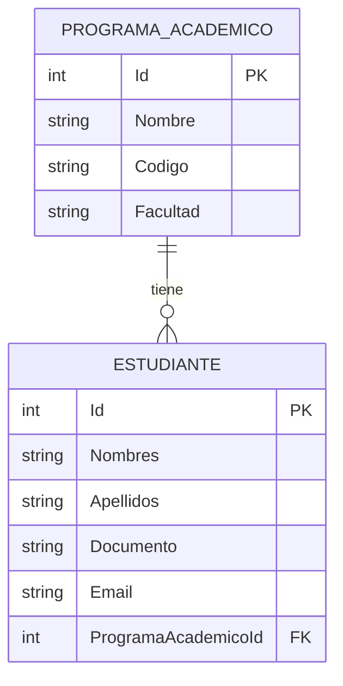

# Programación V - API de Gestión Académica

Web API RESTful desarrollada con **.NET 10** y **ASP.NET Core**, diseñada para la gestión de programas académicos y estudiantes, implementando el **Patrón Repositorio (*Repository Pattern*)**, persistencia local con **Entity Framework Core (SQLite)** y documentación interactiva mediante **Scalar** y **Swagger UI**.

---

## 🛠️ Tecnologías y Herramientas

* **Plataforma:** [.NET 10](https://dotnet.microsoft.com/) / ASP.NET Core Web API
* **ORM:** [Entity Framework Core 10](https://learn.microsoft.com/ef/core/)
* **Base de Datos:** SQLite (`programacionV.db`)
* **Arquitectura:** Patrón Repositorio (*Repository Pattern*) con Inyección de Dependencias (*DI*)
* **Documentación de API:**
  * [Scalar](https://github.com/scalar/scalar) (`Scalar.AspNetCore`)
  * [Swagger / OpenAPI](https://swagger.io/) (`Swashbuckle.AspNetCore` & `Microsoft.AspNetCore.OpenApi`)

---

## 📁 Estructura del Proyecto

```plaintext
programacion-v/
└── programacionV/
    ├── Controllers/                      # Controladores RESTful
    │   ├── EstudianteController.cs
    │   └── ProgramaAcademicoController.cs
    ├── Data/                             # Contexto de base de datos e inicialización
    │   ├── AppDbContext.cs
    │   └── DbInitializer.cs
    ├── Models/                           # Entidades de dominio
    │   ├── Estudiante.cs
    │   └── ProgramaAcademico.cs
    ├── Repositories/                     # Capa de abstracción de datos (Patrón Repositorio)
    │   ├── IEstudianteRepository.cs
    │   ├── EstudianteRepository.cs
    │   ├── IProgramaAcademicoRepository.cs
    │   └── ProgramaAcademicoRepository.cs
    ├── Program.cs                        # Configuración del pipeline y servicios
    ├── appsettings.json                  # Cadena de conexión y configuración
    ├── programacionV.csproj              # Definición y paquetes NuGet del proyecto
    └── programacionV.http                # Peticiones HTTP para pruebas rápidas
```

---

## 🗄️ Modelo de Datos y Relaciones

El proyecto implementa una relación **1 a Muchos (1:N)**:

* **1 `ProgramaAcademico`** tiene muchos **`Estudiante`s**.
* Cada **`Estudiante`** pertenece obligatoriamente a un **`ProgramaAcademico`** (`ProgramaAcademicoId`).



---

## 🚀 Puesta en Marcha

### Requisitos Previos
* Instalar el [.NET 10 SDK](https://dotnet.microsoft.com/download/dotnet/10.0).

### 1. Clonar el repositorio
```bash
git clone https://github.com/usuario/programacion-v.git
cd programacion-v/programacionV
```

### 2. Restaurar paquetes y compilar
```bash
dotnet restore
dotnet build
```

### 3. Ejecutar la API
```bash
dotnet run
```

> **Nota:** La base de datos SQLite (`programacionV.db`) y los datos iniciales (*Seed Data*) se generan automáticamente en el primer inicio de la aplicación.

---

## 📖 Documentación Interactiva de la API

Una vez iniciada la aplicación, accede a la documentación interactiva en tu navegador:

* **Scalar UI (Recomendado):**
  ```
  http://localhost:5156/scalar/v1
  ```
* **Swagger UI:**
  ```
  http://localhost:5156/swagger
  ```
* **Especificación OpenAPI (JSON):**
  ```
  http://localhost:5156/openapi/v1.json
  ```

---

## 📌 Endpoints Principales

### Programas Académicos (`/api/programaacademico`)

| Método | Endpoint | Descripción |
| :--- | :--- | :--- |
| `GET` | `/api/programaacademico` | Listar todos los programas (soporta `?includeEstudiantes=true`) |
| `GET` | `/api/programaacademico/{id}` | Obtener un programa por su ID con sus estudiantes |
| `POST` | `/api/programaacademico` | Crear un nuevo programa académico |
| `PUT` | `/api/programaacademico/{id}` | Actualizar un programa académico existente |
| `DELETE` | `/api/programaacademico/{id}` | Eliminar un programa académico (valida que no tenga estudiantes) |

### Estudiantes (`/api/estudiante`)

| Método | Endpoint | Descripción |
| :--- | :--- | :--- |
| `GET` | `/api/estudiante` | Listar todos los estudiantes (soporta `?programaId={id}`) |
| `GET` | `/api/estudiante/{id}` | Obtener un estudiante por su ID con datos de su programa |
| `POST` | `/api/estudiante` | Crear un estudiante asociado a un programa existente |
| `PUT` | `/api/estudiante/{id}` | Actualizar datos de un estudiante |
| `DELETE` | `/api/estudiante/{id}` | Eliminar un estudiante por su ID |

---

## 🧪 Pruebas con archivo `.http`

Puedes utilizar el archivo [`programacionV.http`](programacionV/programacionV.http) incluido en el proyecto dentro de Visual Studio o VS Code (con la extensión *REST Client*) para realizar pruebas directas contra la API.
