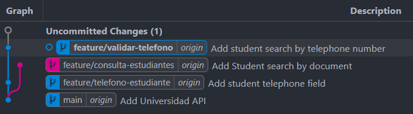
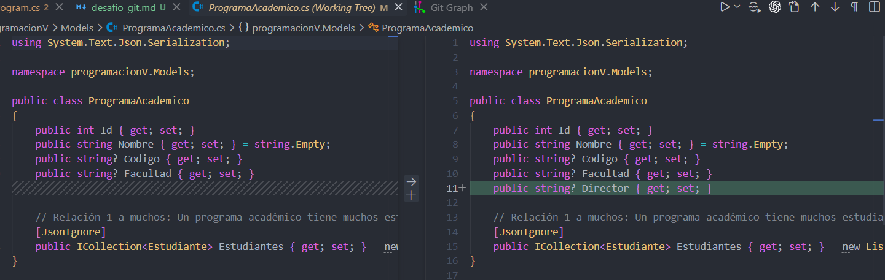

# Desafío Git: trazabilidad, ramas y recuperación de cambios en una API empresarial

## 1. DESAFÍO 1. Construcción del historial de ramas

### 1.1. Diagrama de ramas

```text
main
├── feature/telefono-estudiante
│   └── feature/validar-telefono
└── feature/consulta-estudiante
```




### 1.2. Comandos de ejecución 

**Comandos comunes.**
- Se usa `git checkout -b <nombre_rama>` para crear las ramas y cambiar autmaticamente a esa rama.
- Se ejecuta `git status` para verificar los cambios que se realizaron antes de hacer el commit.
- `git add .` para añadir los cambios a staging
- Se usa `git commit -m "<mensaje>"` para añadir los cambios al repositorio local.
- `git push origin <rama>` enviando los cambios del repositorio local al servidor remoto de Github (subir los cambios al repo). 
- `git pull origin <rama>` descargando el contenido de una rama y actualizandolo en el repositorio local.
**

### 1.3. Creación rama main 

La api estaba orginalmente en la rama `feature/api-university`. Se hace un push a la rama `main`.

```text
git checkout -b main
---
git push -u origin main
Total 0 (delta 0), reused 0 (delta 0), pack-reused 0 (from 0)
remote: 
remote: Create a pull request for 'main' on GitHub by visiting:
remote:      https://github.com/Felipex576/ProgramacionV/pull/new/main
remote: 
To https://github.com/Felipex576/ProgramacionV.git
 * [new branch]      main -> main
branch 'main' set up to track 'origin/main'.
```

### 1.4. Creacion rama feature/telefono-estudiante:

Se debe crear desde la rama `main`. Se realizan cambios a la API, se añadé el campo telefono a la tabla Estudiante.

```text
git checkout -b feature/telefono-estudiante
Switched to a new branch 'feature/telefono-estudiante'
---
git status
On branch feature/telefono-estudiante
Changes not staged for commit:
  (use "git add <file>..." to update what will be committed)
  (use "git restore <file>..." to discard changes in working directory)
        modified:   README.md
        modified:   programacionV/Data/DbInitializer.cs
        modified:   programacionV/Models/Estudiante.cs
        modified:   programacionV/programacionV.http

no changes added to commit (use "git add" and/or "git commit -a")
---
git add .
warning: in the working copy of 'README.md', LF will be replaced by CRLF the next time Git touches it
warning: in the working copy of 'programacionV/Data/DbInitializer.cs', LF will be replaced by CRLF the next time Git touches it
warning: in the working copy of 'programacionV/Models/Estudiante.cs', LF will be replaced by CRLF the next time Git touches it
warning: in the working copy of 'programacionV/programacionV.http', LF will be replaced by CRLF the next time Git touches it
---
git commit -m "Add student telephone field"
[feature/telefono-estudiante a6eccbd] Add student telephone field
 4 files changed, 7 insertions(+)
---
git push origin feature/telefono-estudiante 
Enumerating objects: 17, done.
Counting objects: 100% (17/17), done.
Delta compression using up to 8 threads
Compressing objects: 100% (9/9), done.
Writing objects: 100% (9/9), 924 bytes | 102.00 KiB/s, done.
Total 9 (delta 5), reused 0 (delta 0), pack-reused 0 (from 0)
remote: Resolving deltas: 100% (5/5), completed with 5 local objects.
remote: 
remote: Create a pull request for 'feature/telefono-estudiante' on GitHub by visiting:
remote:      https://github.com/Felipex576/ProgramacionV/pull/new/feature/telefono-estudiante
remote: 
To https://github.com/Felipex576/ProgramacionV.git
 * [new branch]      feature/telefono-estudiante -> feature/telefono-estudiante
```

### 1.5. Creacion rama feature/consulta-estudiante

Se debe crear desde la rama `main`. Se realizan cambios a la API, se añadé funcionalidad para busqueda de Estudiante por el campo documento.

```text
git switch main
Switched to branch 'main'
Your branch is up to date with 'origin/main'.
---
git pull origin main
From https://github.com/Felipex576/ProgramacionV
 * branch            main       -> FETCH_HEAD
Already up to date.
---
git checkout -b feature/consulta-estudiantes
Switched to a new branch 'feature/consulta-estudiantes'
---
git status
On branch feature/consulta-estudiantes
Changes not staged for commit:
  (use "git add <file>..." to update what will be committed)
  (use "git restore <file>..." to discard changes in working directory)
        modified:   README.md
        modified:   programacionV/Controllers/EstudianteController.cs
        modified:   programacionV/Repositories/EstudianteRepository.cs
        modified:   programacionV/Repositories/IEstudianteRepository.cs
        modified:   programacionV/programacionV.http

no changes added to commit (use "git add" and/or "git commit -a")
---
git add .
warning: in the working copy of 'programacionV/Controllers/EstudianteController.cs', LF will be replaced by CRLF the next time Git touches it
warning: in the working copy of 'programacionV/Repositories/EstudianteRepository.cs', LF will be replaced by CRLF the next time Git touches it
warning: in the working copy of 'programacionV/Repositories/IEstudianteRepository.cs', LF will be replaced by CRLF the next time Git touches it
---
git commit -m "Add Student search by document" 
[feature/consulta-estudiantes 34024f1] Add Student search by document
 5 files changed, 27 insertions(+)
---
git push origin feature/consulta-estudiantes 
Enumerating objects: 18, done.
Counting objects: 100% (18/18), done.
Delta compression using up to 8 threads
Compressing objects: 100% (10/10), done.
Writing objects: 100% (10/10), 1.20 KiB | 1.20 MiB/s, done.
Total 10 (delta 7), reused 0 (delta 0), pack-reused 0 (from 0)
remote: Resolving deltas: 100% (7/7), completed with 6 local objects.
remote: 
remote: Create a pull request for 'feature/consulta-estudiantes' on GitHub by visiting:
remote:      https://github.com/Felipex576/ProgramacionV/pull/new/feature/consulta-estudiantes
remote: 
To https://github.com/Felipex576/ProgramacionV.git
 * [new branch]      feature/consulta-estudiantes -> feature/consulta-estudiantes
```

### 1.6. Creacion rama feature/validar-telefono

Se debe crear desde la rama `feature/telefono-estudiante`. Se realizan cambios a la API, se añadé funcionalidad para busqueda de Estudiante por el campo telefono. Se añade la funcionalidad desde esa rama porque es donde se añadió el campo telefono y no se ha realizado el merge a la rama `main`.

```
git switch feature/telefono-estudiante 
Switched to branch 'feature/telefono-estudiante'
---
git pull origin feature/telefono-estudiante 
From https://github.com/Felipex576/ProgramacionV
 * branch            feature/telefono-estudiante -> FETCH_HEAD
Already up to date.
---
git checkout -b feature/validar-telefono
Switched to a new branch 'feature/validar-telefono'
---
git status
On branch feature/validar-telefono
Changes not staged for commit:
  (use "git add <file>..." to update what will be committed)
  (use "git restore <file>..." to discard changes in working directory)
        modified:   README.md
        modified:   programacionV/Controllers/EstudianteController.cs
        modified:   programacionV/Repositories/EstudianteRepository.cs
        modified:   programacionV/Repositories/IEstudianteRepository.cs
        modified:   programacionV/programacionV.http

no changes added to commit (use "git add" and/or "git commit -a")
---
git add .
---
git commit -m "Add student search by telephone number"
[feature/validar-telefono 3a0adcb] Add student search by telephone number
 5 files changed, 27 insertions(+)
---
git push origin feature/validar-telefono 
Enumerating objects: 18, done.
Counting objects: 100% (18/18), done.
Delta compression using up to 8 threads
Compressing objects: 100% (10/10), done.
Writing objects: 100% (10/10), 1.25 KiB | 1.25 MiB/s, done.
Total 10 (delta 7), reused 0 (delta 0), pack-reused 0 (from 0)
remote: Resolving deltas: 100% (7/7), completed with 6 local objects.
remote: 
remote: Create a pull request for 'feature/validar-telefono' on GitHub by visiting:
remote:      https://github.com/Felipex576/ProgramacionV/pull/new/feature/validar-telefono
remote: 
To https://github.com/Felipex576/ProgramacionV.git
 * [new branch]      feature/validar-telefono -> feature/validar-telefono
```

### 1.7. Verificacion gráfico de ramas 

```text
git log --oneline --graph --decorate --all
* 3a0adcb (HEAD -> feature/validar-telefono, origin/feature/validar-telefono) Add student search by telephone number
* a6eccbd (origin/feature/telefono-estudiante, feature/telefono-estudiante) Add student telephone field
| * 34024f1 (origin/feature/consulta-estudiantes, feature/consulta-estudiantes) Add Student search by document
|/  
* 46c530a (origin/main, main) Add Universidad API
```

---


## 2. DESAFÍO 2. Investigación del historial

### 2.1. ¿Cuál es el hash corto del commit donde se agregó el teléfono del estudiante?

El hash del commit es: `a6eccbd`, rama `feature/telefono-estudiante`.

```text
git log --oneline
3a0adcb (HEAD -> feature/validar-telefono, origin/feature/validar-telefono) Add student search by telephone number
a6eccbd (origin/feature/telefono-estudiante, feature/telefono-estudiante) Add student telephone field
46c530a (origin/main, main) Add Universidad API
```

### 2.2. ¿Quién realizó ese commit?

Se busca el hash para ver quien realizó el commit, el mensaje, la fecha y el correo

```text
git show --no-patch --format=fuller a6eccbd
commit a6eccbdd60b7a8971344b7d213b3d9a9697685b0 (origin/feature/telefono-estudiante, feature/telefono-estudiante)
Author:     Felipex576 <lfca576@hotmail.com>
AuthorDate: Sat Sep 5 21:58:45 2026 -0500
Commit:     Felipex576 <lfca576@hotmail.com>
CommitDate: Sat Sep 5 21:58:45 2026 -0500

    Add student telephone field
```

### 2.3. ¿Cuál fue el mensaje utilizado?

Con el comando del 2.3 se obtiene esa informacion.

**Mensaje usado:** `Add student telephone field`

### 2.4. ¿En qué fecha fue realizado?

Con el comando del 2.3 se obtiene esa informacion.

**Fecha:** `Sat Sep 5 21:58:45 2026 -0500` Hora en UTC-5.

### 2.5. ¿Qué archivos fueron modificados en ese commit?

Con el siguiente comando se busca el hash del commit para obtener los archivos que fueron modificados. En total fueron `4 archivos` modificados.

```
git show --name-only --format="" a6eccbd
README.md
programacionV/Data/DbInitializer.cs
programacionV/Models/Estudiante.cs
programacionV/programacionV.http
```

### 2.6. ¿Cuál fue el commit donde se implementó la validación del teléfono?

El hash del commit es el `3a0adcb` el cual está asignado a la rama `feature/validar-telefono`

```text
git log --oneline
3a0adcb (HEAD -> feature/validar-telefono, origin/feature/validar-telefono) Add student search by telephone number
a6eccbd (origin/feature/telefono-estudiante, feature/telefono-estudiante) Add student telephone field
46c530a (origin/main, main) Add Universidad API
```

---

## DESAFÍO 3. Recuperación de cambios

Se añade el campo Director a ProgramaAcademico sin añadirlo a staging ni haciendo el commit. Se modifican 4 archivos. `git diff` para ver la diferencia entre archivos. Se usa `git restore <carpeta/archivo>` para quitar los cambios que no han sido commiteados. 

```text
git status
On branch main
Your branch is up to date with 'origin/main'.

Changes not staged for commit:
  (use "git add <file>..." to update what will be committed)
  (use "git restore <file>..." to discard changes in working directory)
        modified:   README.md
        modified:   programacionV/Data/DbInitializer.cs
        modified:   programacionV/Models/ProgramaAcademico.cs
        modified:   programacionV/programacionV.http
---
git diff programacionV/Models/ProgramaAcademico.cs
warning: in the working copy of 'programacionV/Models/ProgramaAcademico.cs', LF will be replaced by CRLF the next time Git touches it
diff --git a/programacionV/Models/ProgramaAcademico.cs b/programacionV/Models/ProgramaAcademico.cs
index 0b65831..7de3718 100644
--- a/programacionV/Models/ProgramaAcademico.cs
+++ b/programacionV/Models/ProgramaAcademico.cs
@@ -8,6 +8,7 @@ public class ProgramaAcademico
     public string Nombre { get; set; } = string.Empty;
     public string? Codigo { get; set; }
     public string? Facultad { get; set; }
+    public string? Director { get; set; }
---
git restore programacionV/
---
git restore README.md 
---
git status
On branch main
Your branch is up to date with 'origin/main'.
```

- **git diff se puede visualizar de forma mas grafica desde vscode.**  


- **En vscode se puede visualizar los cambios en la Source Control (Ctrl + Shift + G).**

- Si se hubiera hecho el commit, los archivos no se pierden al hacer git restore.
---

## DESAFÍO 4. Deshacer un commit

Se hace el commit añadiendo el campo Director a ProgramaAcademico. El hash del commit es `89fda6f`. Se deshace el commit con `git reset --soft HEAD~1`. Para verificar si el commit se deshizo, ejecutar git status y ver el mensaje `Changes to be committed:`. Esto significa que los cambios se añadieron a staging pero no se han commiteado. Los archivos mantienen su modificación y estan listo para hacer el commit. Al hacer el nuevo commit se genera el siguiente hash `9ab8547`. 

Si el commit que se desea deshacer ya hubiera sido publicado y compartido en GitHub, no conviene usar `git reset` para eliminarlo del historial compartido. Si se ejecuta este comando, desaparecería de la historia visible de la rama. Esto puede causar problemas a otros desarrolladores que hayan trabajado sobre ese commit. El comando que se puede utlizar es `git revert <hash>`  

```
git pull origin main
From https://github.com/Felipex576/ProgramacionV
 * branch            main       -> FETCH_HEAD
Already up to date.
---
git checkout -b feature/cambio-prueba
Switched to a new branch 'feature/cambio-prueba'
---
git status
On branch feature/cambio-prueba
Changes not staged for commit:
  (use "git add <file>..." to update what will be committed)
  (use "git restore <file>..." to discard changes in working directory)
        modified:   README.md
        modified:   programacionV/Data/DbInitializer.cs
        modified:   programacionV/Models/ProgramaAcademico.cs
        modified:   programacionV/programacionV.http
---
git add README.md programacionV/
---
git commit -m "Add Director field to ProgramaAcademico"
[feature/cambio-prueba 89fda6f] Add Director field to ProgramaAcademico
 4 files changed, 10 insertions(+), 4 deletions(-)
---
git reset --soft HEAD~1
--
git status
On branch feature/cambio-prueba
Changes to be committed:
  (use "git restore --staged <file>..." to unstage)
        modified:   README.md
        modified:   programacionV/Data/DbInitializer.cs
        modified:   programacionV/Models/ProgramaAcademico.cs
        modified:   programacionV/programacionV.http
---
git commit -m "Add Director field to ProgramaAcademico"
[feature/cambio-prueba 9ab8547] Add Director field to ProgramaAcademico
 4 files changed, 10 insertions(+), 4 deletions(-)
```