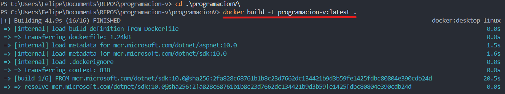
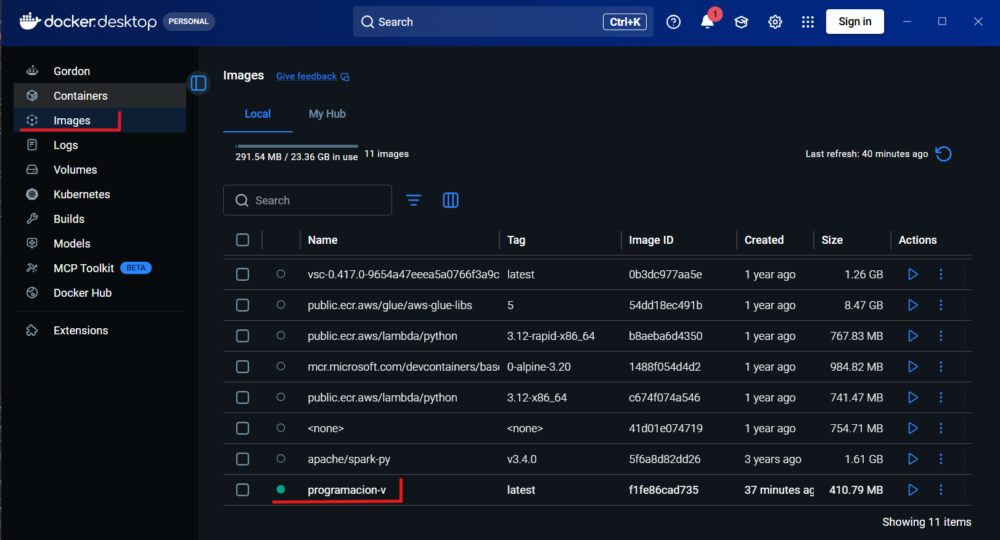
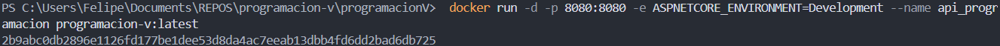
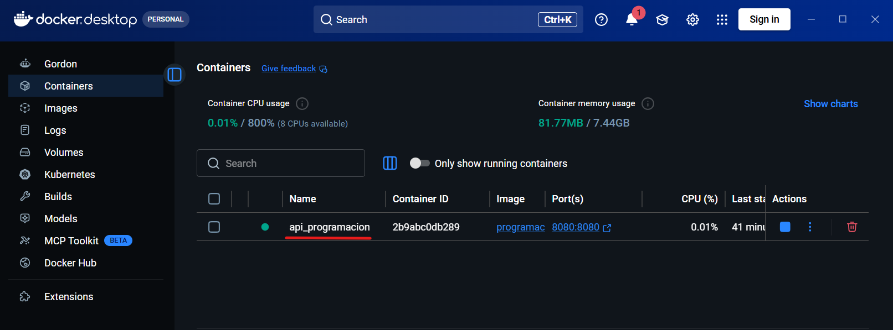
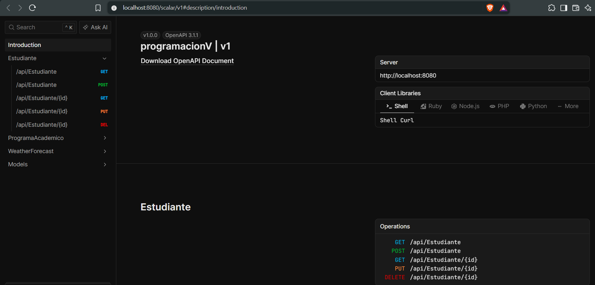
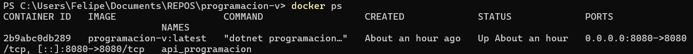
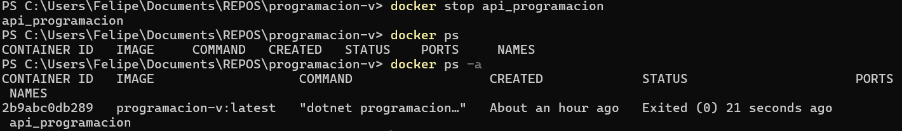
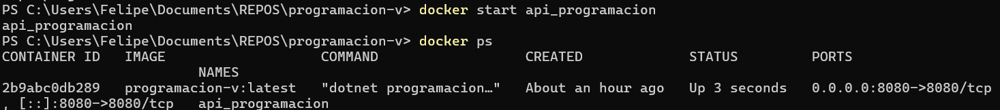

# Desafío DevOps: de la API al despliegue

## DESAFÍO 1. Contenerización de la API

### Dockerfile

El Dockerfile permite la construcción automatizada de una aplicación, en este caso la API. En lugar de crear un contenedor pesado con todas las herramientas de desarrollo, este archivo implementa un patrón llamado Multi-Stage Build (Construcción multietapa), dividiendo el ciclo de vida de la imagen en tres fases:

- **Etapa 1: base (Entorno de ejecución)** 
Parte de la imagen oficial mcr.microsoft.com/dotnet/aspnet:10.0, la cual contiene únicamente el runtime necesario para correr aplicaciones ASP.NET Core en .NET 10, sin compiladores ni herramientas pesadas. Se define el directorio de trabajo /app, se documenta que el contenedor escuchará en el puerto 8080 y se usará ese puerto mediante la variable de entorno ASPNETCORE_HTTP_PORTS=8080.

- **Etapa 2: build (Entorno de compilación)**
Utiliza la imagen completa del SDK (mcr.microsoft.com/dotnet/sdk:10.0), que sí incluye compiladores, analizadores y herramientas de restauración. Primero copia el archivo programacionV.csproj y ejecuta dotnet restore. Si se cambia el código en un controlador pero no se agregagan nuevos paquetes NuGet, Docker reutiliza la capa en caché, haciendo las compilaciones posteriores casi instantáneas. Luego copia el resto del código (COPY . .) y ejecuta dotnet publish -c Release, empaquetando los binarios optimizados para producción dentro de /app/publish.

- **Etapa 3: final (Empaquetado definitivo)**
Regresa a la etapa ligera base y toma prestados únicamente los binarios compilados en la etapa anterior (COPY -- from=build /app/publish .). Al descartar el SDK y el código fuente, la imagen resultante pasa de pesar casi 1 GB a rondar los 150-200 MB, reduciendo la superficie de ataque y optimizando el tiempo de despliegue. Por último, define el punto de entrada (ENTRYPOINT ["dotnet "programacionV.dll"]), que es el comando que Kestrel ejecuta en cuanto el contenedor se enciende.

```Dockerfile
FROM mcr.microsoft.com/dotnet/aspnet:10.0 AS base
WORKDIR /app

EXPOSE 8080
ENV ASPNETCORE_HTTP_PORTS=8080

FROM mcr.microsoft.com/dotnet/sdk:10.0 AS build
WORKDIR /src

COPY ["programacionV.csproj", "./"]
RUN dotnet restore "programacionV.csproj"

COPY . .
RUN dotnet publish "programacionV.csproj" -c Release -o /app/publish /p:UseAppHost=false

FROM base AS final
WORKDIR /app
COPY --from=build /app/publish .

ENTRYPOINT ["dotnet", "programacionV.dll"]
```

### .dockerignore

Similar a un .gitignore, pero orientado al proceso de construcción de Docker. Este archivo filtra y excluye selectivamente:

```.dockerignore
**/.git
**/.vs
**/bin
**/obj
**/.vscode
```

Gracias a este archivo, el contexto que se envía a Docker es limpio y ligero, asegurando que cada compilación sea predecible y reproducible en cualquier entorno.

### Comandos de ejecucion

En la carpeta del proyecto: 

- **Compilar la imagen (Dockerfile)**
```powershell
docker build -t programacion-v:latest .
```





- **Ejecutar el contenedor (api_programacion, puerto 8080)**
 
```powershell
docker run -d -p 8080:8080 -e ASPNETCORE_ENVIRONMENT=Development --name api_programacion programacion-v:latest
```




### Verficacion

En un navegador abrir 'http://localhost:8080/scalar/v1' para verficar que la api se haya cargado y generado correctamente en el puerto 8080.



### Preguntas

**¿Cuál es la diferencia entre una imagen Docker y un contenedor?**
Una imagen de Docker es una plantilla estática de solo lectura, mientras que un contenedor es una instancia en ejecución de esa imagen. Las imagenes se descargan o se crean (Dockerfile) y los contenedores se inician, detienen y eliminan durante el ciclo de vida de la aplicación sin alterar la imagen original.

**¿Por qué la aplicación puede ejecutarse en un contenedor aunque el usuario no ejecute directamente dotnet run?**
Se puede ejecutar porque toda la aplicación esta compilada dentro de la imagen (Dockerfile). Solo se debe ejecutar docker run... para iniciar el contenedor, lo que seria el equivalente a dotnet run.

---

---

## DESAFÍO 2. Administración del contenedor

### Listar contenedores activos

```powershell
docker ps
```
Con este comando se puede obtener informacion básica de cada contenedor como el id: `2b9abc0db289`, la imagen: `programacion-v`, puertos: `8080`, estado: `Up`, tiempo de creación. Se evidencia el contenedor api_programacion



### Detener contenedor

Con este comando se detiene el contendor por medio del nombre Tambien se puede usar el id.
```powershell
docker stop <nombre_contenedor>
```

Verificar todos los contendores, se muestra que el contenedor esta detenido. Tambien se puede ver en Docker desktop. El estado del contendor ahora es `Exited`.

```powershell
docker ps -a
```



### Iniciar contenedor detenido.

Con este comando se inicia o reanuda un contenedor detenido. Recordar que si el contenedor no se ha iniciado anteriormente se debe ejecutar docker run... Verificar con docker ps o en docker desktop que el contenedor se inició. El estado vuelve a ser `Up`

```powershell
docker start <nombre_contenedor>
```


En el navegador abrir 'http://localhost:8080/scalar/v1' validando que la API esta disponible. 

### Preguntas

**¿Detener un contenedor elimina la imagen utilizada para crearlo?**
No, detener el contenedor pausa su ejecucion, la API no va estar disponible. La imagen queda intacta. Si se desea eliminar la imagen se puede ejecutar `docker rmi <image_id>` o desde docker desktop.

**¿Qué diferencia existe entre consultar los contenedores en ejecución y consultar todos los contenedores existentes?**
Al consultar todos los contenedores, se muestra todos los contenedores, tanto los que están funcionando como los que están detenidos o apagados `docker ps -a`. Todo lo contrario con `docker ps` que muestra los contenedores en ejecución.

---

---


## DESAFÍO 3. Construcción automática con GitHub Actions


### Preguntas
**¿Qué evento provocó la ejecución automática del workflow?**
**¿Qué ventaja tiene comprobar automáticamente que una aplicación compila después de publicar un cambio?**
**¿Qué ocurriría con el workflow si la compilación genera un error?**
